# Kết quả thực nghiệm

Thư mục này lưu các hình ảnh kết quả của quá trình huấn luyện mô hình Transformer trên bài toán Modular Arithmetic.

Các thực nghiệm được thực hiện trong **25.000 bước huấn luyện** với learning rate `0.001`.

## 1. Kết quả trên p = 197

Thiết lập:

* Modulus: `p = 197`
* Train fraction: `0.3`
* Tổng số bước: `100.000`
* Learning rate: `0.001`

| Ảnh                 | Cấu hình | Số lớp | Chiều ẩn | Weight Decay | Số Head | Learning Rate | Grokking Step |
| ------------------- | -------- | -----: | -------: | -----------: | ------: | ------------: | ------------: |
| [Ảnh 1](image1.png) | base     |      2 |      128 |            1 |       4 |         0.001 |          2600 |
| [Ảnh 2](image2.png) | scale    |      4 |      128 |            1 |       4 |         0.001 |          2200 |
| [Ảnh 3](image3.png) | scale    |      2 |      128 |            1 |       8 |         0.001 |          2600 |
| [Ảnh 4](image4.png) | scale    |      2 |      128 |          0.5 |       4 |         0.001 |          3200 |
| [Ảnh 5](image5.png) | scale    |      2 |      128 |          1.5 |       4 |         0.001 |          1300 |
| [Ảnh 6](image6.png) | scale    |      2 |      128 |          0.1 |       4 |         0.001 |      Không GK |
| [Ảnh 7](image7.png) | scale    |      2 |      128 |            2 |       4 |         0.001 |          1200 |
| [Ảnh 8](image8.png) | scale    |      2 |      128 |            5 |       4 |         0.001 |          1600 |
| [Ảnh 9](image9.png) | scale    |      2 |      128 |           10 |       4 |         0.001 |       Chưa GK |

### Hình ảnh

**Ảnh 1 — Baseline**

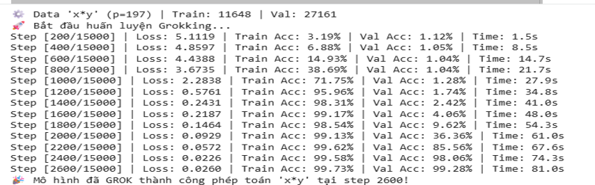

**Ảnh 2 — Tăng số lớp lên 4**

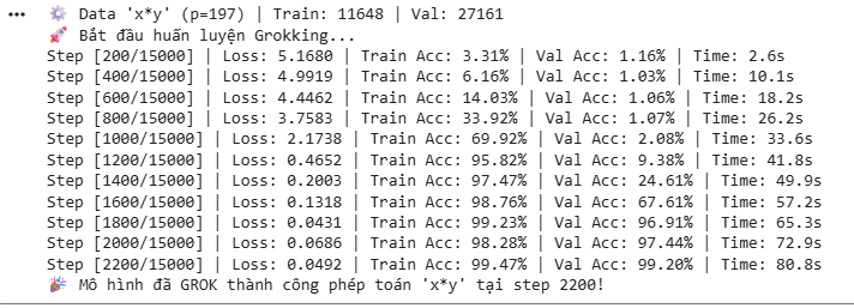

**Ảnh 3 — Tăng số head lên 8**

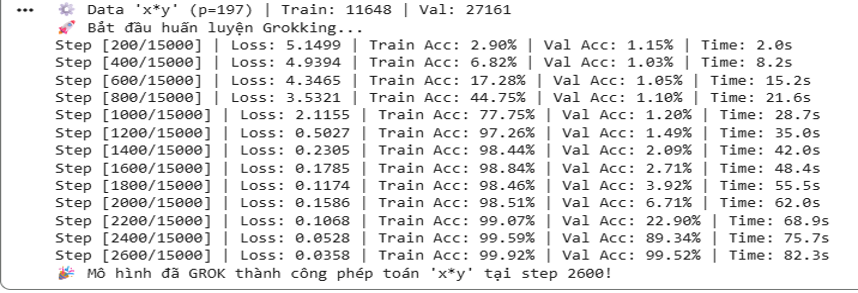

**Ảnh 4 — Weight decay = 0.5**

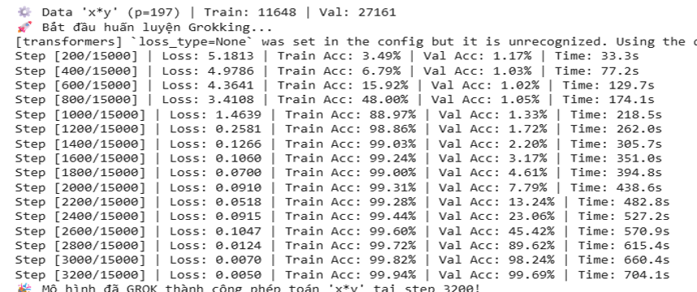

**Ảnh 5 — Weight decay = 1.5**

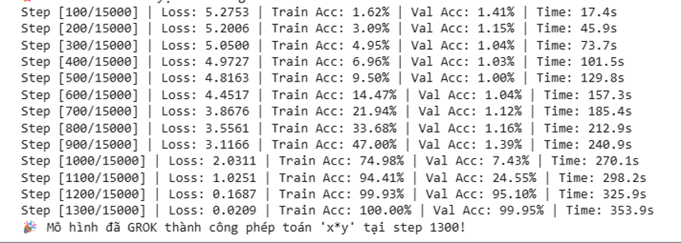

**Ảnh 6 — Weight decay = 0.1**

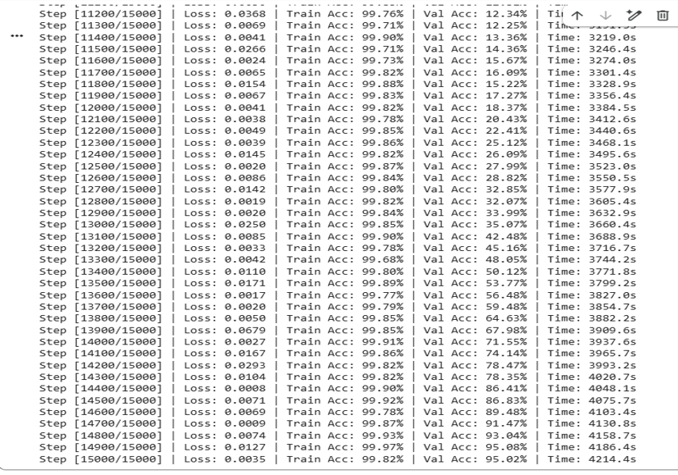

**Ảnh 7 — Weight decay = 2**

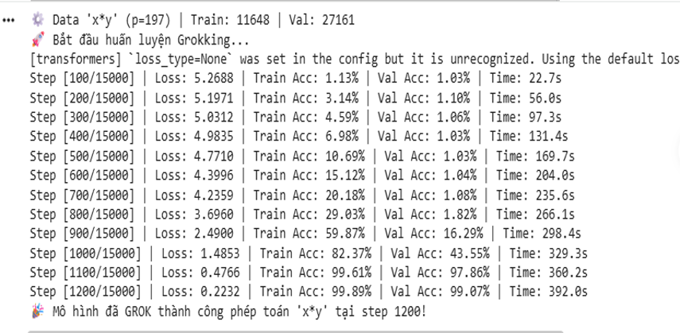

**Ảnh 8 — Weight decay = 5**

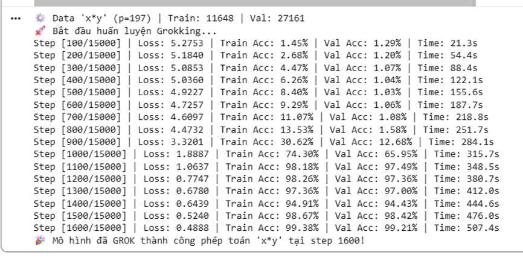

**Ảnh 9 — Weight decay = 10**

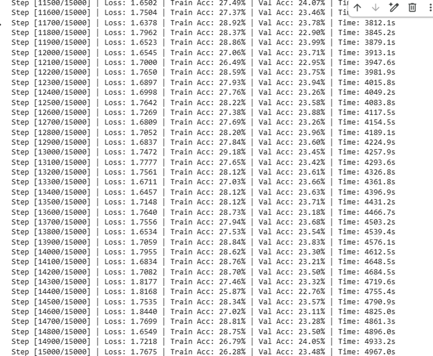

---

## 2. Kết quả trên p = 383

Thiết lập:

* Modulus: `p = 383`
* Train fraction: `0.15`
* Tổng số bước: `100.000`
* Learning rate: `0.001`
* Cấu hình: baseline

| Ảnh                   | Cấu hình | Số lớp | Chiều ẩn | Weight Decay | Số Head | Learning Rate | Grokking Step |
| --------------------- | -------- | -----: | -------: | -----------: | ------: | ------------: | ------------: |
| [Ảnh 10](image10.png) | base     |      2 |      128 |            1 |       4 |         0.001 |         34300 |

### Hình ảnh

**Ảnh 10 và 11 — Baseline trên p = 383**

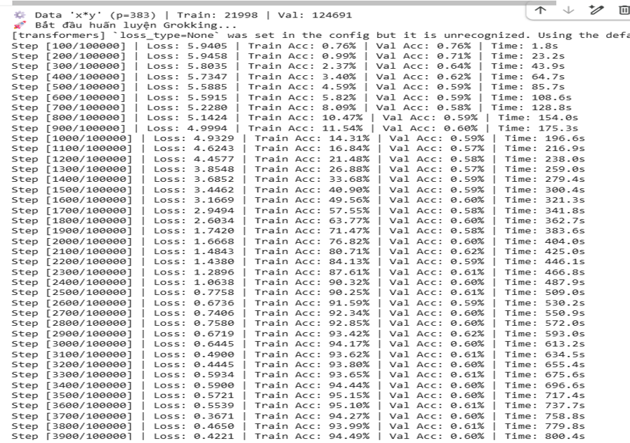
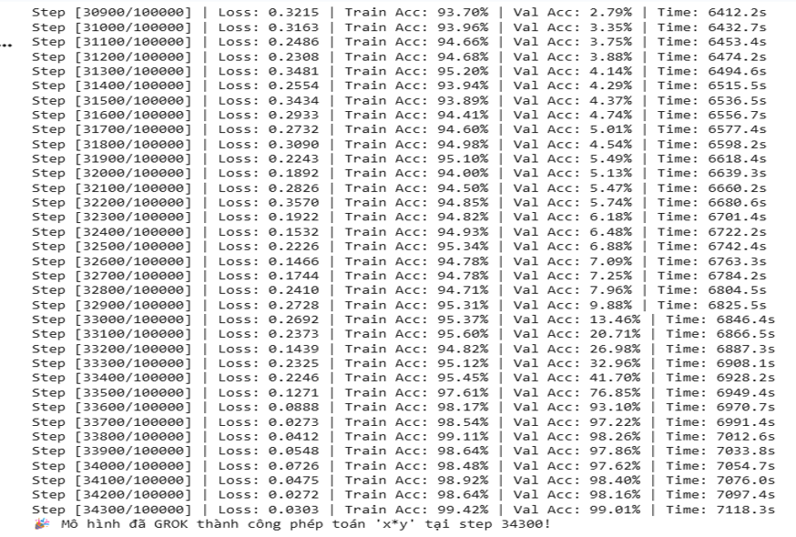
---

## 3. Tóm tắt

Các kết quả trên `p = 197` cho thấy thời điểm Grokking thay đổi giữa các cấu hình mô hình và các giá trị weight decay được khảo sát.

Với cấu hình baseline, khi thay đổi từ `p = 197` với train fraction `0.3` sang `p = 383` với train fraction `0.15`, thời điểm Grokking được ghi nhận thay đổi từ `2600` lên `34300` bước.

Các kết quả và hình ảnh trong thư mục này được sử dụng để phục vụ việc phân tích hiện tượng Grokking và làm cơ sở cho các thực nghiệm tiếp theo.
