# Kết quả thực nghiệm

Thư mục này lưu các hình ảnh kết quả của quá trình huấn luyện mô hình Transformer trên bài toán Modular Arithmetic, bao gồm các thực nghiệm Grokking và In-Context Learning (ICL).

---

# PHẦN I — GROKKING MODULAR ARITHMETIC

Các thực nghiệm được thực hiện trong **25.000 bước huấn luyện** với learning rate `0.001`.

## 1. Kết quả trên p = 197

Thiết lập:

- Modulus: `p = 197`
- Train fraction: `0.3`
- Tổng số bước: `15.000`
- Learning rate: `0.001`

| Ảnh | Cấu hình | Số lớp | Chiều ẩn | Weight Decay | Số Head | Learning Rate | Grokking Step |
|---|---|---:|---:|---:|---:|---:|---:|
| [Ảnh 1](image1.png) | base | 2 | 128 | 1 | 4 | 0.001 | 2600 |
| [Ảnh 2](image2.png) | scale | 4 | 128 | 1 | 4 | 0.001 | 2200 |
| [Ảnh 3](image3.png) | scale | 2 | 128 | 1 | 8 | 0.001 | 2600 |
| [Ảnh 4](image4.png) | scale | 2 | 128 | 0.5 | 4 | 0.001 | 3200 |
| [Ảnh 5](image5.png) | scale | 2 | 128 | 1.5 | 4 | 0.001 | 1300 |
| [Ảnh 6](image6.png) | scale | 2 | 128 | 0.1 | 4 | 0.001 | Không GK |
| [Ảnh 7](image7.png) | scale | 2 | 128 | 2 | 4 | 0.001 | 1200 |
| [Ảnh 8](image8.png) | scale | 2 | 128 | 5 | 4 | 0.001 | 1600 |
| [Ảnh 9](image9.png) | scale | 2 | 128 | 10 | 4 | 0.001 | Chưa GK |

### Hình ảnh

**Ảnh 1 — Baseline**

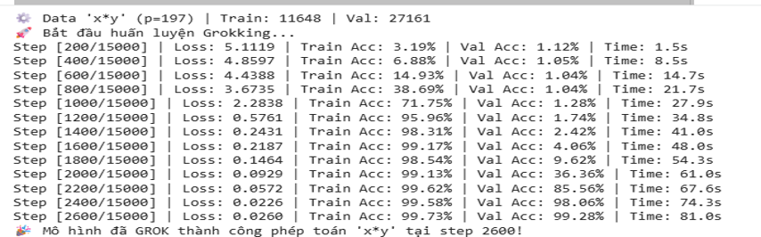

**Ảnh 2 — Tăng số lớp lên 4**

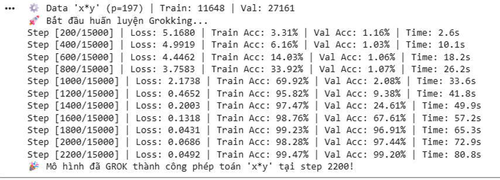

**Ảnh 3 — Tăng số head lên 8**

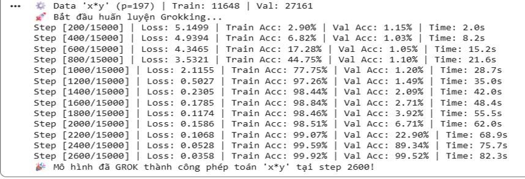

**Ảnh 4 — Weight decay = 0.5**

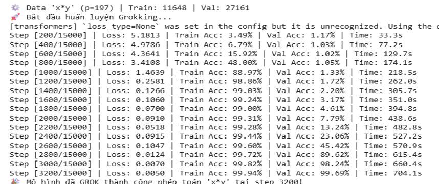

**Ảnh 5 — Weight decay = 1.5**

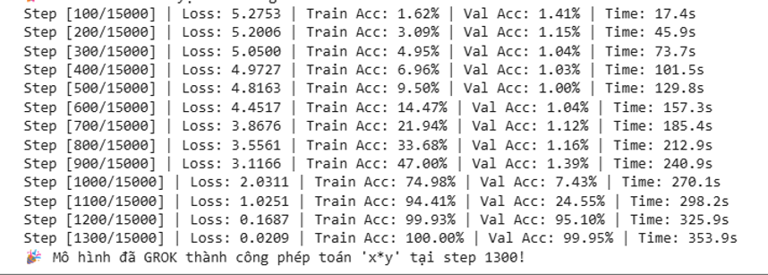

**Ảnh 6 — Weight decay = 0.1**

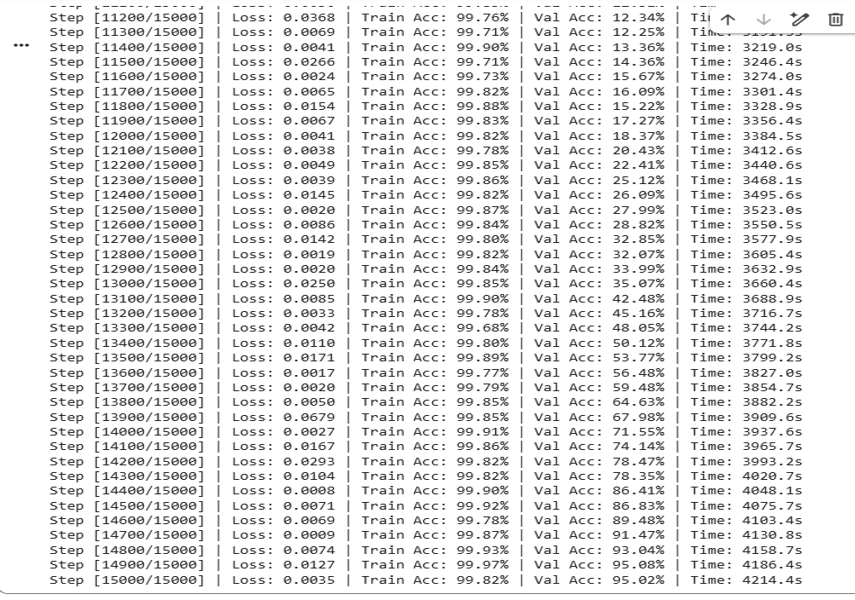

**Ảnh 7 — Weight decay = 2**

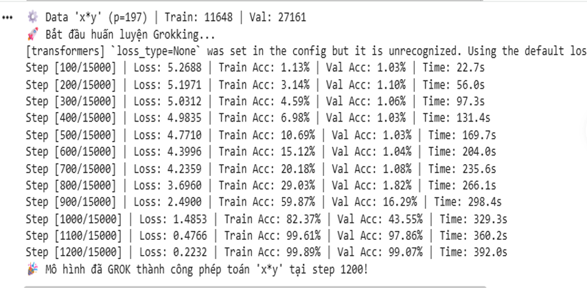

**Ảnh 8 — Weight decay = 5**

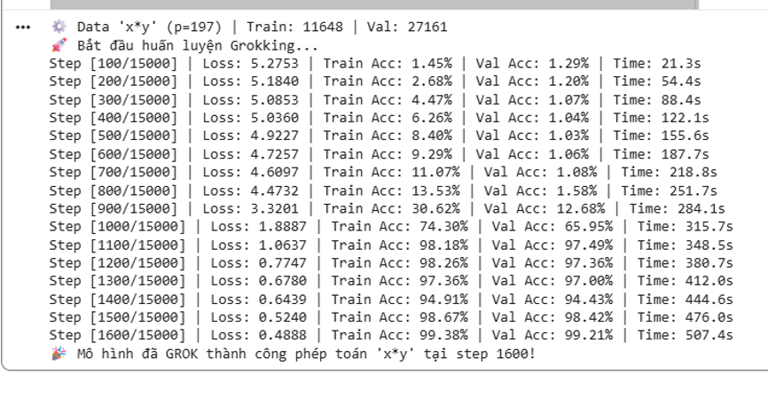

**Ảnh 9 — Weight decay = 10**

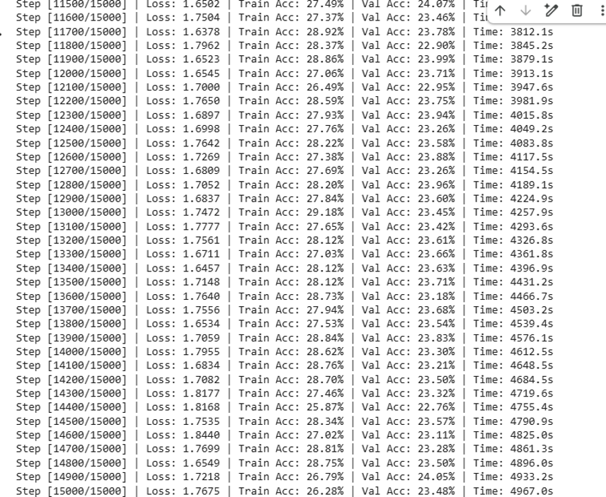

---

## 2. Kết quả trên p = 383

Thiết lập:

- Modulus: `p = 383`
- Train fraction: `0.15`
- Tổng số bước: `100.000`
- Learning rate: `0.001`
- Cấu hình: baseline

| Ảnh | Cấu hình | Số lớp | Chiều ẩn | Weight Decay | Số Head | Learning Rate | Grokking Step |
|---|---|---:|---:|---:|---:|---:|---:|
| [Ảnh 10](image10.png) | base | 2 | 128 | 1 | 4 | 0.001 | 34300 |

### Hình ảnh

**Ảnh 10 và 11 — Baseline trên p = 383**

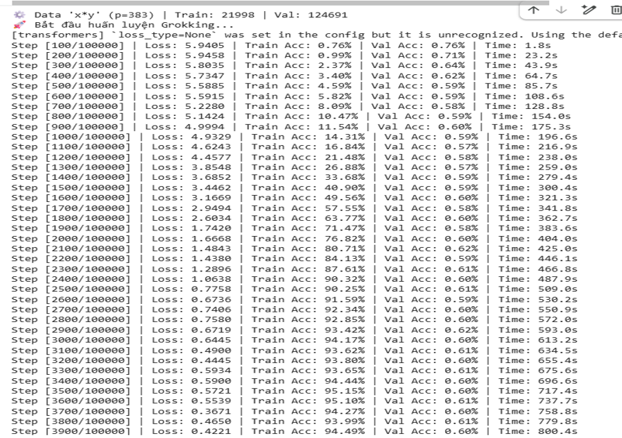

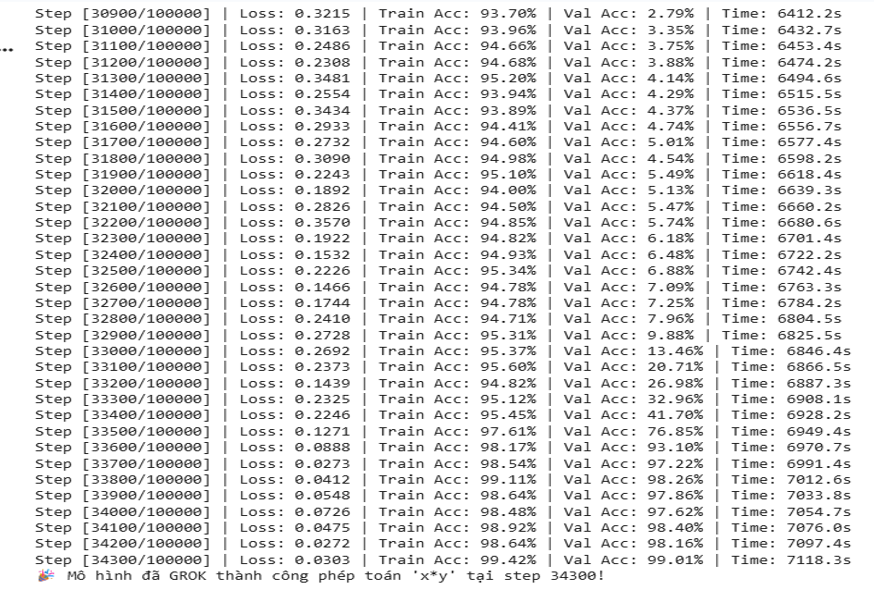

---

## 3. Tóm tắt

Các kết quả trên `p = 197` cho thấy thời điểm Grokking thay đổi giữa các cấu hình mô hình và các giá trị weight decay được khảo sát.

Với cấu hình baseline, khi thay đổi từ `p = 197` với train fraction `0.3` sang `p = 383` với train fraction `0.15`, thời điểm Grokking được ghi nhận thay đổi từ `2600` lên `34300` bước.

Các kết quả và hình ảnh trong phần này được sử dụng để phục vụ việc phân tích hiện tượng Grokking và làm cơ sở cho các thực nghiệm tiếp theo.

---

# PHẦN II — IN-CONTEXT LEARNING (ICL)

Các thực nghiệm trong phần này khảo sát khả năng In-Context Learning (ICL) của Transformer trên bài toán Modular Arithmetic.

Thiết lập baseline:

- Modulus: `P = 17`
- Rule fraction: `0.8`
- Input fraction: `0.8`
- Số layer: `2`
- Hidden dimension: `128`
- Số Head: `4`
- Context length: `32`
- Learning rate: `1.5e-4`
- Weight Decay: `2.0`
- Tổng số bước: `80.000`
- Seed: `42`

Các điều kiện đánh giá:

- `S_train_id`
- `S_test_id`
- `S_train_ood`
- `S_test_ood`

Các mức số lượng examples trong context:

```text
0, 1, 2, 4, 8, 16, 31 shots
```

## 4. Kết quả Baseline

Thiết lập:

- Modulus: `P = 17`
- Rule fraction: `0.8`
- Input fraction: `0.8`
- Số layer: `2`
- Hidden dimension: `128`
- Số Head: `4`
- Context length: `32`
- Learning rate: `1.5e-4`
- Weight Decay: `2.0`
- Tổng số bước: `80.000`
- Seed: `42`

| Ảnh | Cấu hình | P | Rule Fraction | Input Fraction | Layer | Hidden | Head | Weight Decay | Learning Rate |
|---|---|---:|---:|---:|---:|---:|---:|---:|---:|
| [Baseline](Baseline.png) | base | 17 | 0.8 | 0.8 | 2 | 128 | 4 | 2.0 | 1.5e-4 |

### Hình ảnh

**Baseline**

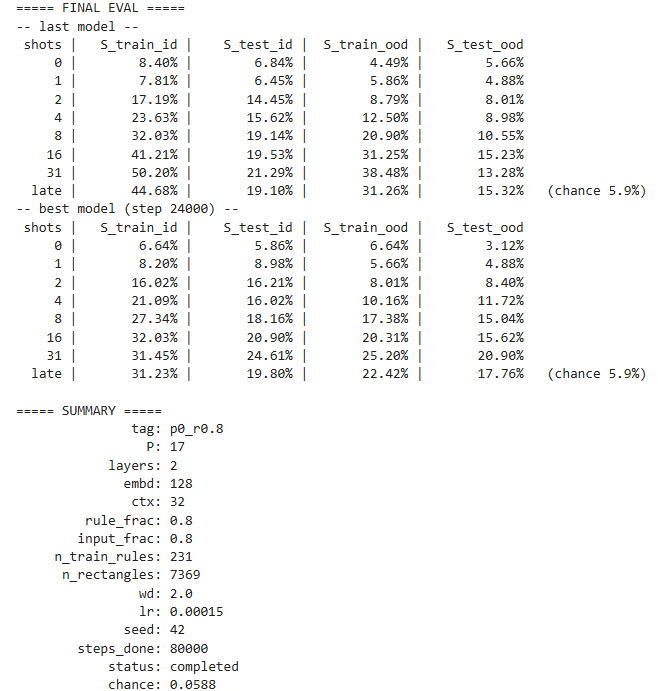

---

## 5. Kết quả với Weight Decay

Thiết lập baseline:

```text
Weight Decay = 2.0
```

Các cấu hình được khảo sát:

```text
Weight Decay = 1.0
Weight Decay = 3.0
```

| Ảnh | Cấu hình | Weight Decay | Best Step | S_train_id Late | S_train_ood Late | S_test_ood Late |
|---|---|---:|---:|---:|---:|---:|
| [WD 1](wd1.png) | scale | 1.0 | 54000 | 45.35% | 29.28% | 11.57% |
| [WD 3](wd3.png) | scale | 3.0 | 70000 | 25.16% | 17.04% | 14.31% |

### Hình ảnh

**WD 1 — Weight Decay = 1.0**

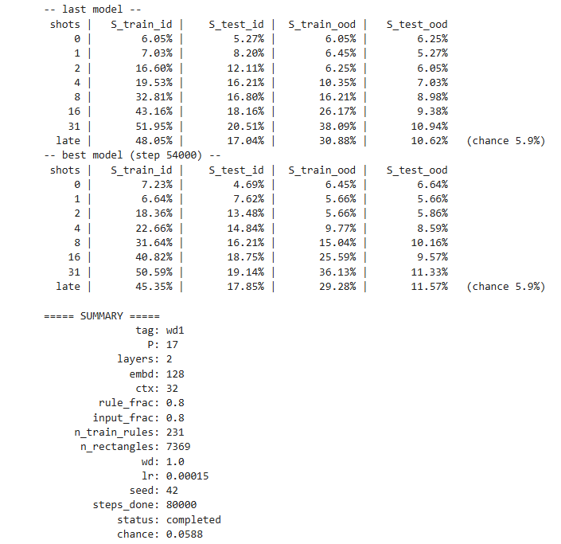

**WD 3 — Weight Decay = 3.0**

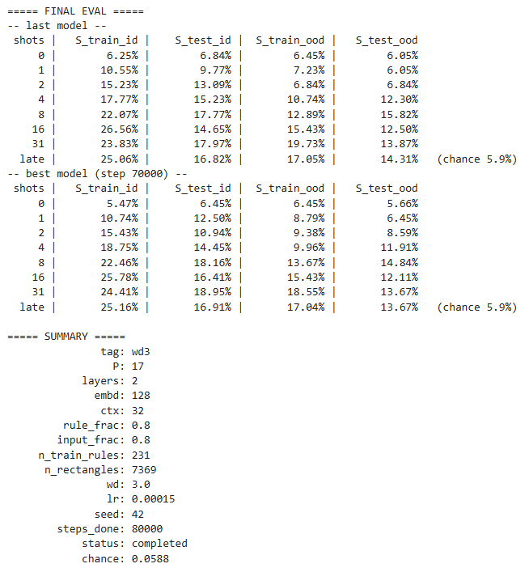

---

## 6. Kết quả với Learning Rate

Thiết lập baseline:

```text
Learning Rate = 1.5e-4
```

Các cấu hình được khảo sát:

```text
Learning Rate = 1e-4
Learning Rate = 3e-4
```

| Ảnh | Cấu hình | Learning Rate | Best Step | S_train_id Late | S_train_ood Late | S_test_ood Late |
|---|---|---:|---:|---:|---:|---:|
| [LR 1e-4](lr1e-4.png) | scale | 1e-4 | 27000 | 29.31% | 19.17% | 14.22% |
| [LR 3e-4](lr3e-4.png) | scale | 3e-4 | 22500 | 61.94% | 55.93% | 20.17% |

### Hình ảnh

**LR 1e-4 — Learning Rate = 1e-4**


**LR 3e-4 — Learning Rate = 3e-4**


---

## 7. Kết quả với Embedding Dimension

Thiết lập baseline:

```text
Hidden dimension = 128
```

Các cấu hình được khảo sát:

```text
Hidden dimension = 64
Hidden dimension = 256
```

| Ảnh | Cấu hình | Hidden | Best Step | S_train_id Late | S_train_ood Late | S_test_ood Late |
|---|---|---:|---:|---:|---:|---:|
| [Embd 64](embd64.png) | scale | 64 | 54500 | 20.95% | 15.52% | 10.71% |
| [Embd 256](embd256.png) | scale | 256 | 10000 | 59.57% | 53.50% | 27.39% |

### Hình ảnh

**Embd 64 — Hidden dimension = 64**

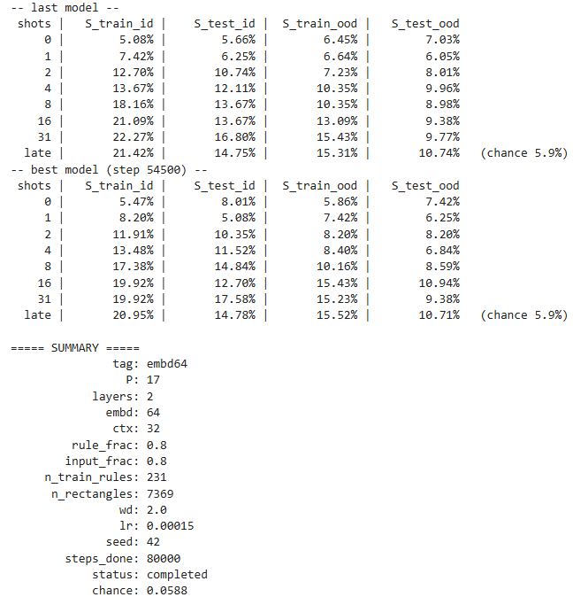

**Embd 256 — Hidden dimension = 256**

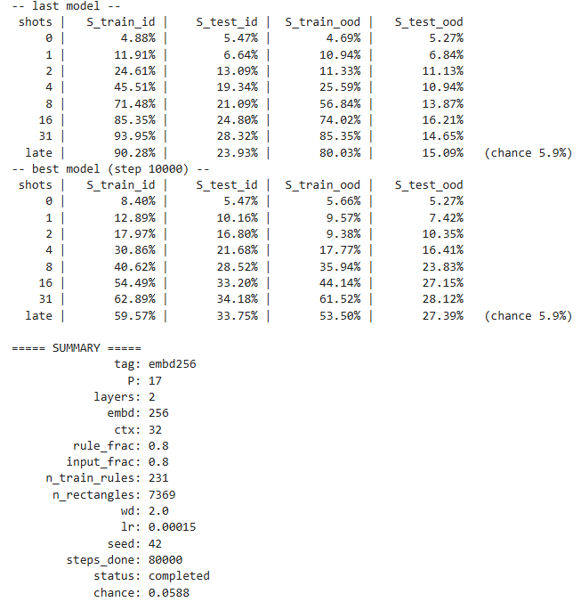

---

## 8. Kết quả với số Layer

Thiết lập baseline:

```text
Số layer = 2
```

Các cấu hình được khảo sát:

```text
Số layer = 4
Số layer = 6
```

| Ảnh | Cấu hình | Số Layer | Best Step | S_train_id Late | S_train_ood Late | S_test_ood Late |
|---|---|---:|---:|---:|---:|---:|
| [Layers 4](layers4.png) | scale | 4 | 63000 | 97.39% | 91.64% | 88.90% |
| [Layers 6](layers6.png) | scale | 6 | 61500 | 97.78% | 94.25% | 89.75% |

### Hình ảnh

**Layers 4 — Số layer = 4**

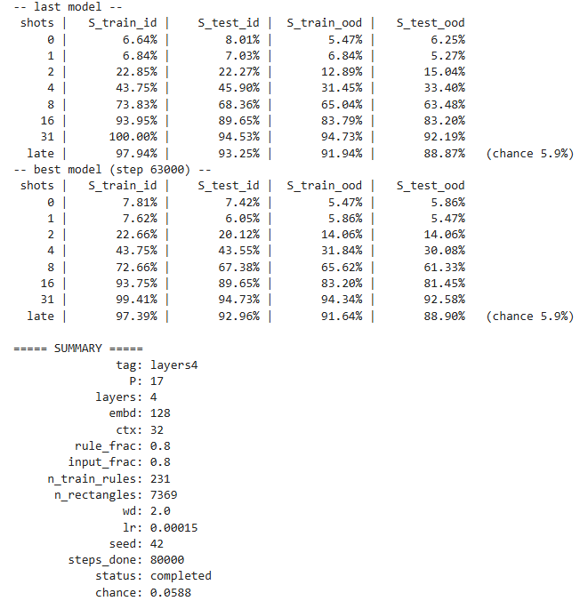

**Layers 6 — Số layer = 6**


---

## 9. Kết quả với modulo P

Thiết lập baseline:

```text
P = 17
```

Thực nghiệm mở rộng:

```text
P = 29
```

| Ảnh | Cấu hình | P | Layer | Hidden | Head | Rule Fraction | Input Fraction | Learning Rate | Weight Decay | Best Step |
|---|---|---:|---:|---:|---:|---:|---:|---:|---:|---:|
| [P29](P29.png) | scale | 29 | 2 | 128 | 4 | 0.8 | 0.8 | 1.5e-4 | 2.0 | 34500 |

Kết quả:

```text
S_train_id Late = 4.16%
S_train_ood Late = 2.05%
S_test_ood Late = 3.56%
Chance = 3.4%
Steps done = 53500
Status = stuck_stop
```

### Hình ảnh

**P29 — Modulo P = 29**

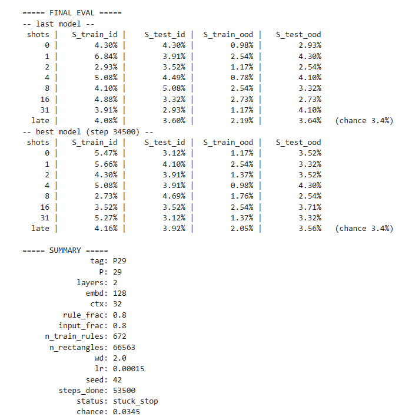

---

## 10. Tóm tắt kết quả ICL

Các thực nghiệm ICL cho thấy accuracy thay đổi theo số lượng examples trong context ở nhiều cấu hình.

Đối với `P = 17`, một số cấu hình cho thấy accuracy trên `S_test_ood` tăng khi số lượng shots tăng.

Với `embd = 256`, accuracy `S_test_ood` tăng từ `5.27%` ở 0-shot lên `28.12%` ở 31-shot.

Với `layers = 4`, accuracy `S_test_ood` tăng từ `5.86%` ở 0-shot lên `92.58%` ở 31-shot.

Với `layers = 6`, accuracy `S_test_ood` tăng từ `7.03%` ở 0-shot lên `93.36%` ở 31-shot.

Đối với `P = 29`, accuracy `S_test_ood` vẫn gần mức chance `3.4%` ở các mức shots được đánh giá.

Các kết quả và hình ảnh trong phần này được sử dụng để phục vụ việc phân tích khả năng In-Context Learning và làm cơ sở cho các thực nghiệm tiếp theo.